## **Courier Management System**
This is a simple web application (Single Page Application) for a Courier Management System built using Flask, a lightweight web framework in Python and VueJS 3, a JavaScript framework. The application streamlines the end-to-end courier and package delivery processes, enhancing efficiency, accuracy, and the overall customer experience for courier service providers and their clients
## **Technologies Used:**

- Flask (web framework in Python)
- VueJS 3 CDN (for UI and client-side rendering)
- VueJS router 4 cdn (for routing at client side)
- SQLAlchemy (database toolkit and ORM)
- Flask-Login (user authentication)
- Flask-Bcrypt (for securely hashing)
- Flask-WTF (web forms)
- Flask-RESTful (extension for building RESTful APIs)
- Flask-mail (for notification and conformation mails)
- SQLite (database)
- Bootstrap 5, HTML, CSS, JavaScript (front-end)
- Pygal (graphical visualizations)


## **Database Schema Design**

- **User (user) Table:**
  - Stores user information, including name, username, email, and role.
  - Has relationships with requests, shopping carts, cart items, orders, and package tracking.

- **Request (request) Table:**
  - Records user requests with courier manager details.
  - Many-to-One relationship with the User table.

- **Cart (cart) Table:**
  - Represents user shopping carts.
  - Many-to-One relationship with the User table.

- **Cart Item (cart\_item) Table:**
  - Contains details of items in user shopping carts.
  - Many-to-One relationships with Cart and User tables.

- **Order (order) Table:**
  - Stores courier orders with sender, recipient, and package details.
  - Has relationships with users and package tracking entries.

- **Package Tracking (package\_tracking) Table:**
  - Tracks package status with timestamps and locations.
  - Many-to-One relationships with User, Order, and Courier Manager tables.

- **Courier Manager (courier\_manager) Table:**
  - Contains details of courier managers.
  - One-to-One relationship with the User table.

## **File Structure:**

```
Courier Management System

            ├──── System

            │    ├──── app.py

            │    ├──── application

            │    │    ├──── \_\_init\_\_.py

            │    │    ├──── user\_views.py

            │    │    ├──── admin\_views.py

            │    │    ├──── authentication.py

            │    │    ├──── location.py

            │    │    ├──── mail.py

            │    │    ├──── manager\_views.py

            │    │    ├──── map.html

            │    │    ├──── models.py

            │    │    ├──── summary.py

            │    │    ├──── static

            │    │    │    ├──── javascripts

            │    │    │    │    ├──── components

            │    │    │    │    │    ├──── admin\_dashboard.js

            │    │    │    │    │    ├──── admin\_management.js

            │    │    │    │    │    ├──── cart.js

            │    │    │    │    │    ├──── home.js

            │    │    │    │    │    ├──── login.js

            │    │    │    │    │    ├──── manager\_dashboard.js

            │    │    │    │    │    ├──── PasswordRecovery.js

            │    │    │    │    │    ├──── profile.js

            │    │    │    │    │    ├──── register.js

            │    │    │    │    │    ├──── summary.js

            │    │    │    │    ├──── main.js

            │    │    │    │    ├──── router.js

            │    │    │    ├──── manager\_csv

            │    │    │    │    ├──── manager\_kumbakonam\_report.csv

            │    │    │    │    ├──── manager\_rameswaram\_report.csv

            │    │    │    │    ├──── manager\_trichy\_report.csv

            │    │    │    ├──── summary

            │    │    │    │    ├──── courier\_manager\_distribution.svg

            │    │    │    │    ├──── order\_per\_user\_distribution.svg

            │    │    │    │    ├──── request\_status\_distribution.svg

            │    │    │    │    ├──── user\_role\_distribution.svg

            │    │    ├──── templates

            │    │    │    ├──── base.html

            │    │    │    ├──── nav.html

            │    ├──── instance

            │    │    ├──── todos.db

            │    ├──── requirements.txt
```
## **API Design**
The API has been meticulously designed to retrieve essential data pertaining to a user's interactions on the platform. This data encompasses a variety of actions, including admin approvals, manager rejections, location deletions, location edits, manager updates to courier tracking status (from received to in transit to delivered), user updates to the shopping cart, and product removals from the cart. To access this valuable information, the API offers a single, well-defined endpoint that requires the user to provide their unique ID as input. Upon successful execution, the API responds by delivering a structured JSON object containing the relevant engagement data.

## **Application Usage & Features:** 
### For Users
### **User Authentication**

- **User Registration:** Users can sign up, specifying their name, username, email, and password. A "manager" prefix in the username designates them as managers, while others become regular users.
- **User Login:** Registered users can log in securely, accessing their respective roles and functionalities.
- **Password Recovery:** Users can confirm their identity for password recovery, providing username, name, and email.
- **Role-Based Access:** The application enforces role-based access control, allowing or denying access to specific features based on the user's role (“admin”, "manager", or "regular user").
- **Security Measures:** Passwords are securely hashed using Bcrypt, and flash messages provide user feedback for successful operations and notifications.

### **User Home Page**
- **Add Courier Order:**
  - Users can add courier items with ackage details, sender details, recipient details, and delivery preferences for items to their cart.

- **Cart Management**
  - They can update package details, sender details, recipient details, and delivery preferences for items in their cart.
  - Items can be removed from the cart.
  - Users can view their cart and calculate the total price based on selected options.

- **Checkout and Order Processing:**
  - Users can proceed to checkout, creating custom order IDs and orders with associated package tracking entries.
  - Orders can be cancelled if the user wants anytime.


### **User Profile Page**
- **Request for New Courier Manager:**
  - Users with the "manager" role can request to become a courier manager.
  - They can provide details such as contact information, address, and location.
- **View User Orders:**
  - Users can view their previous orders, including tracking details with timestamps, current locations, and delivery statuses.


### **User Related Other Features**
- **API Endpoints for Location Information:**
  - Users can retrieve details of available cities, districts, and states related to courier managers.
- **Error Handling:** The code includes error handling to provide informative responses to clients.
- **Custom Order ID Generation:** The application generates custom order IDs for orders based on user and sequence numbers.
- **Email Notifications:** The code includes functions to send various email notifications, such as order confirmation and cancellation.
### For Admin
### **Admin Dashboard Page**
- **Authentication and Role Check:** The code includes login and role checks, ensuring that only logged-in users with admin privileges can access certain functionalities.
- **Location Management:**
  - Admins can retrieve a list of all locations associated with courier managers.
  - Admins can update the details of existing locations, including city, district, state, and pincode.
  - Admins can delete existing locations.
### **Admin Management Page**
- **Request Management:**
  - Admins can retrieve a list of requests made by users who want to become courier managers.
  - The request details include the user's information, such as name, username, email, and role, along with the requested courier manager details.
  - Admins can approve or reject requests.
  - Approving a request can include changing the user's role to "manager" and creating a new Courier\_Manager entry with the approved details.
### **Summary Page**
- **Graph Generation:**
  - Admins can generate and serve graphs, which might be related to the courier management system.
  - The summary page displays bar graphs visualize data related to users, requests, courier managers, and orders. The purpose of these graphs is to provide insights into the distribution of data within these categories.
  - The graphs provide insights into the performance of different products and categories over time.

### For Manager
### **Manager Dashboard Page**

- **Orders by Location:**
  - Managers can retrieve orders that are relevant to their current location.
  - The code first fetches the manager's current location and then queries the orders to identify which ones have reached or are passing through the manager's location.
  - The list of orders, including order details, is returned.
- **Transit Order:**
  - Managers can update the status of an order to "In Transit."
  - This endpoint is likely used when a manager picks up an order for delivery.
- **Deliver Order:**
  - Managers can update the status of an order to "Delivered."
  - This endpoint is likely used when a manager successfully delivers an order.
- **Generate CSV Report:**
  - Managers can generate a CSV report of orders specific to their location.
  - The report includes information such as Order ID, Package Number, Delivery Preferences, and Total Price.
  - The generated CSV file is stored in a directory and can be downloaded as an attachment.
  - After generating the report, a notification email is sent.


### **Location.py:**

This code file defines several functions for working with geographical data and calculating the total price for a courier based on various factors. Let's go through these functions:

- **get\_city\_dict(sender\_city, recipient\_city):**
  - This function creates a dictionary of cities with their corresponding latitude and longitude. It is used to represent the route of the courier, including sender and recipient cities.
  - It queries the Courier\_Manager table to retrieve the latitude and longitude of each city.
- **haversine\_distance(coord1, coord2):**
  - This function calculates the Haversine distance between two sets of latitude and longitude coordinates.
  - The Haversine formula is used to calculate the distance between two points on the Earth's surface.
- **calculate\_total\_distance(path, city\_dict):**
  - This function calculates the total distance for a given path (a list of cities).
  - It uses the haversine\_distance function to calculate the distance between each pair of consecutive cities in the path.
- **short\_path(city\_dict):**
  - This function calculates the shortest path and the corresponding distance between the origin city and the destination city, considering all possible permutations of intermediate cities.
  - It uses itertools to generate all possible permutations and iterates through them to find the shortest path.
- **totalprice(shortest\_distance, package\_number, weight, height, width, delivery\_preferences):**
  - This function calculates the total price for a courier based on various factors, including distance, package number, weight, dimensions (height and width), and delivery preferences.
  - The delivery\_preferences parameter determines the weight factor for distance pricing. If it's 'premium,' the weight factor is 0.2; otherwise, it's 0.01.
  - The function calculates the distance price and the weight price and returns the total price in the appropriate units.

### **Mail.py:**

The code provided defines several functions for sending different types of email notifications using the Flask-Mail extension. These functions are responsible for sending various notifications related to the courier system. Here's a brief explanation of each function:

- **send\_confirmation\_email():**
  - Sends an email with the subject "Courier Generation" to a specified recipient.
  - The email body contains the message "Your Courier has been generated."
  - It uses the Flask-Mail extension to send the email.
- **send\_notification\_email():**
  - Sends an email with the subject "CSV Generation Notification" to a specified recipient.
  - The email body contains the message "Your CSV file has been generated."
  - It uses the Flask-Mail extension to send the email.
- **send\_transit\_email():**
  - Sends an email with the subject "Transit Notification" to a specified recipient.
  - The email body contains the message "Your Courier has been in transit."
  - It uses the Flask-Mail extension to send the email.
- **send\_cancel\_email():**
  - Sends an email with the subject "Cancel Notification" to a specified recipient.
  - The email body contains the message "Your Courier has been cancelled."
  - It uses the Flask-Mail extension to send the email.
- **send\_deliver\_email():**
  - Sends an email with the subject "Delivery Notification" to a specified recipient.
  - The email body contains the message "Your Courier has been delivered."
  - It uses the Flask-Mail extension to send the email.

All of these functions follow a similar pattern:

- They create a Message object with a specific subject, sender, and recipient.
- They set the body of the email message.
- They send the email using mail.send(msg) provided by the Flask-Mail extension.

### **To log out**, 
- click the “Logout” link in navbar.


## Screenshots

### **For Regular User :**

<table align="center">
  <tr>
    <td>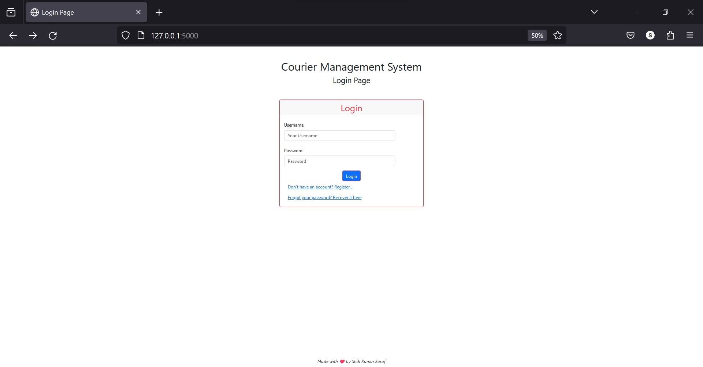</td>
  </tr>
  <tr>
    <td><em>Index or Login Page</em></td>
  </tr>

  <tr>
    <td>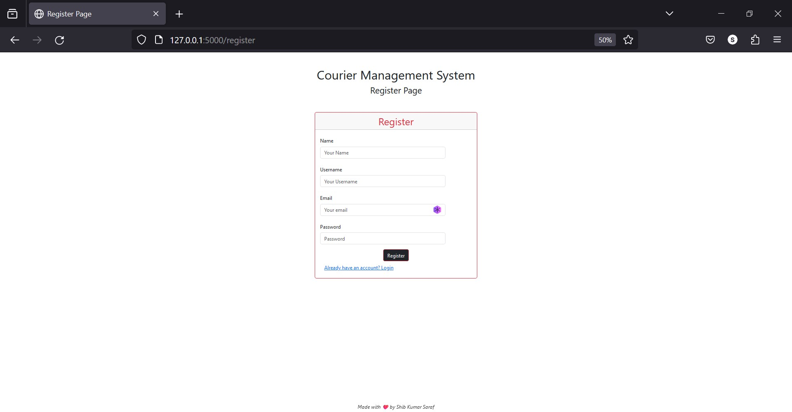</td>
  </tr>
  <tr>
    <td><em>Register Page</em></td>
  </tr>
  
  <tr>
    <td>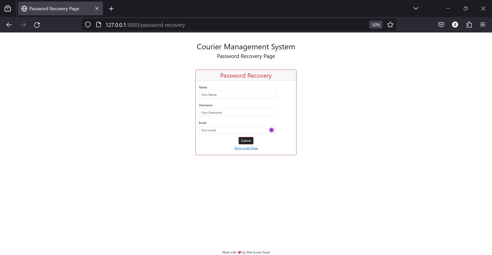</td>
  </tr>
  <tr>
    <td><em>Password Recovery Page</em></td>
  </tr>


  <tr>
    <td>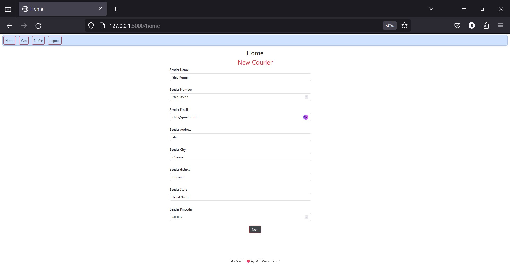</td>
  </tr>
  <tr>
    <td>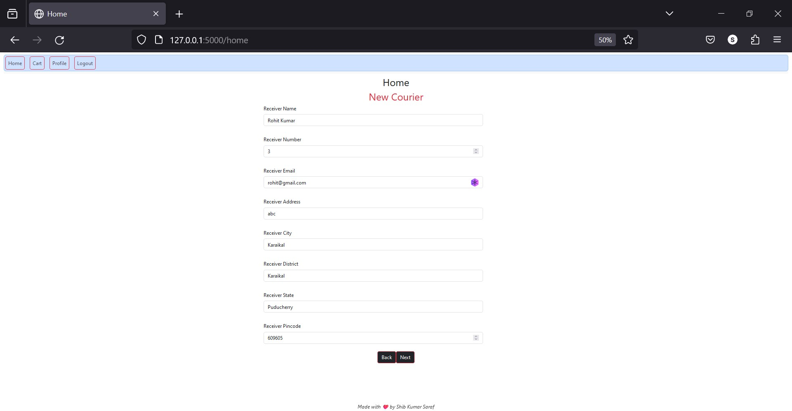</td>
  </tr>  
  <tr>
    <td>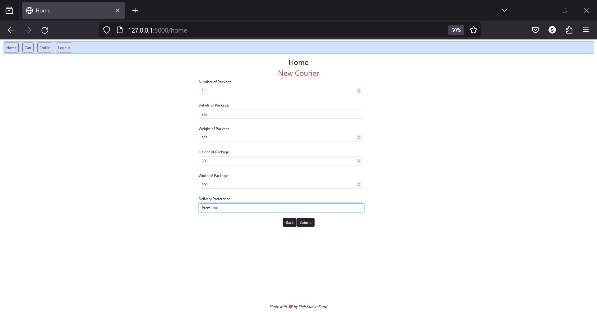</td>
  </tr>
  <tr>
    <td><em>Home Page </em></td>
  </tr>

  <tr>
    <td>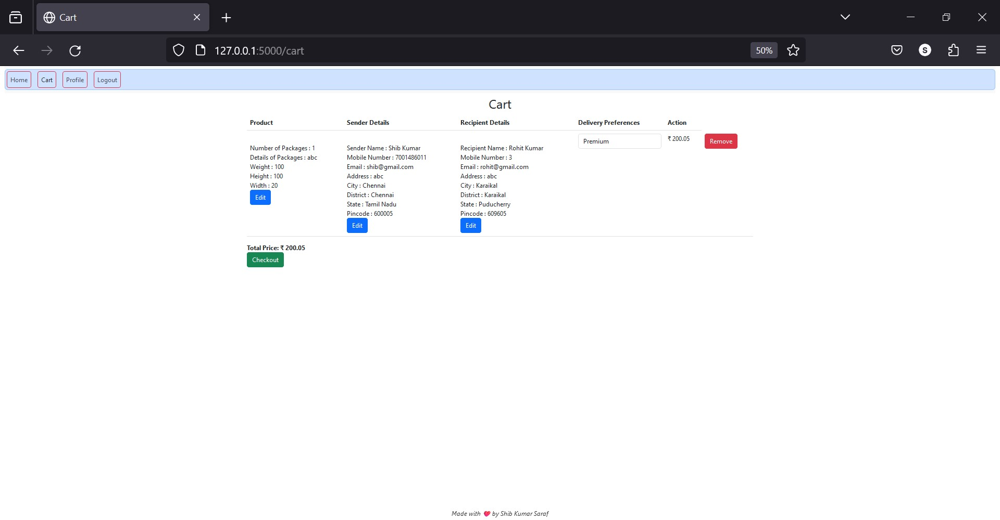</td>
  </tr>
  <tr>
    <td><em>Cart Page </em></td>
  </tr>

  <tr>
    <td>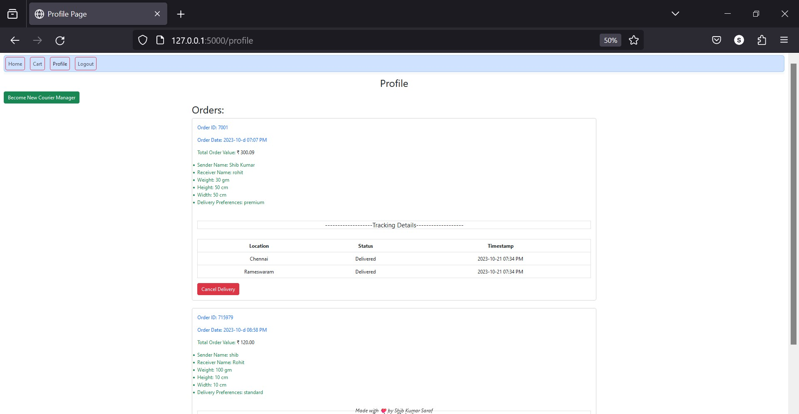</td>
  </tr>
  <tr>
    <td><em>Profile Page </em></td>
  </tr>
</table>

### **For Admin :**

<table align="center">
  <tr>
    <td>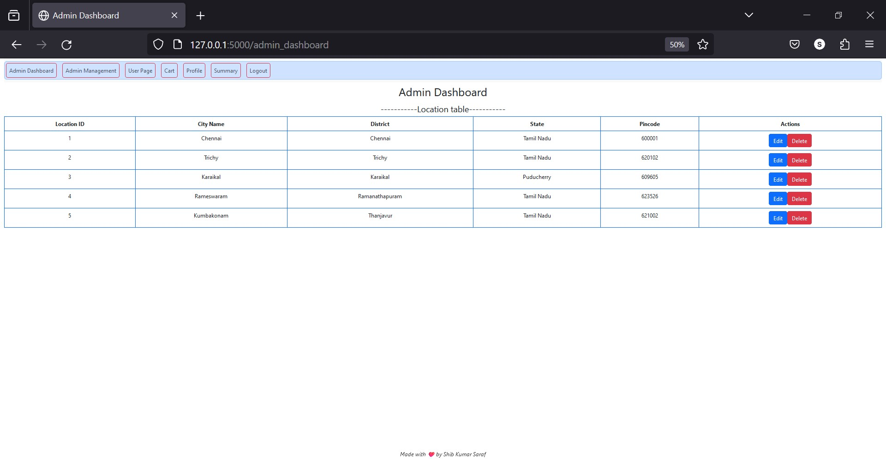</td>
  </tr>
  <tr>
    <td><em>Admin Dashboard Page</em></td>
  </tr>
  <tr>
    <td>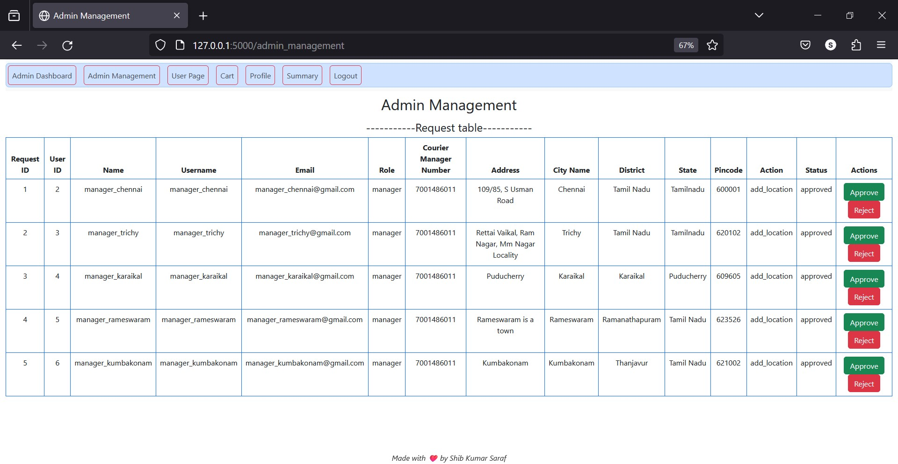</td>
  </tr>
  <tr>
    <td><em>Admin Management Page</em></td>
  </tr>
  <tr>
    <td>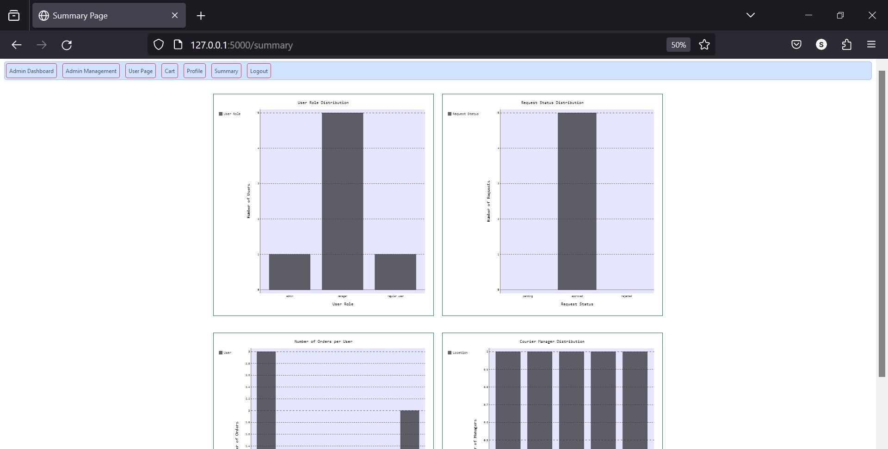</td>
  </tr>
  <tr>
    <td><em>Summary Page </em></td>
  </tr>
  </table>

### **For Courier Manager :**

<table align="center">
  <tr>
    <td></td>
  </tr>
  <tr>
    <td><em>Manager Dashboard Page</em></td>
  </tr>
  <tr>
    <td>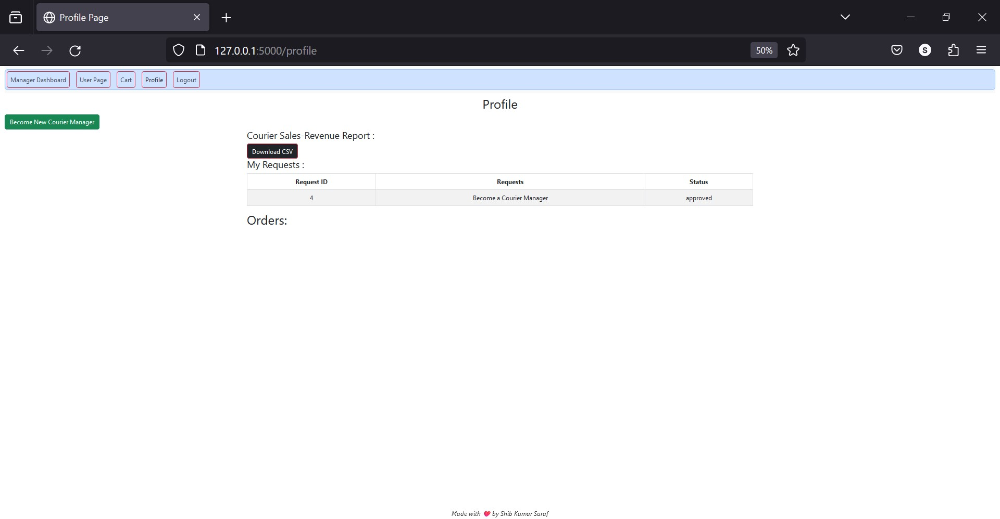</td>
  </tr>
  <tr>
    <td><em>Manager Profile Page</em></td>
  </tr>
  </table>

## Getting Started

Before you can run the Courier Management System Web App, ensure that you have the necessary prerequisites installed on your machine.

### Prerequisites

Make sure you have the following installed:

- [Python 3.x](https://www.python.org/downloads/): The programming language used to run the app.

### Installation

Follow these steps to set up the Courier Management System Web App on your local machine: 

1. **Clone the Repository:**

   Open your terminal and run the following commands:

   ```bash
   git clone https://github.com/shib1111111/Courier-Management-System.git
   cd Grocery_Store/System

   ```

2. **Install Dependencies:**

Run the following command to install the required dependencies:

```bash
pip install -r requirements.txt
  ```

## Usage
To run the Courier Management System Web App, execute the following command in your terminal:
```bash
python app.py  
```
Visit the provided local URL (usually http://localhost:5000) in your web browser to access the app. <br>


## Contributing

We welcome contributions to enhance Courier Management System Web App. Feel free to open issues or submit pull requests.

## License

This project is licensed under the [MIT License](LICENSE).

Thank you for using the Courier Management System Web App ! Feel free to reach out with any questions or feedback.

<em style="color: #ff66b2; font-weight: bold;">✨ --- Designed & made with Love by Shib Kumar Saraf ✨</em>
